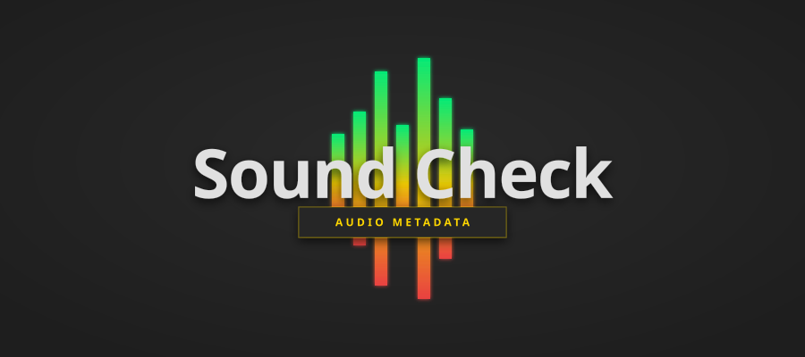

# Sound Check

<p align="center">
  
</p>

<p align="center">
  <strong>Audio metadata analysis for desktop workflows.</strong>
</p>

<p align="center">
  
  &nbsp;
  
  &nbsp;
  
</p>

## Overview

Sound Check is a desktop audio metadata analyzer built with Tauri, React, and Rust.
It verifies format from file signatures (magic bytes) instead of extensions, then reports core metadata in a sortable table.

## Capabilities

| Capability              | Details                                                                                           |
| ----------------------- | ------------------------------------------------------------------------------------------------- |
| **Format Verification** | Detects file type from header signatures before decode.                                           |
| **Metadata Extraction** | Reads title, artist, album, codec, sample rate, duration, channels, and bit depth when available. |
| **Batch Analysis**      | Processes multiple files through the Rust backend.                                                |
| **Operational UI**      | Drag-and-drop input, native picker, keyboard shortcuts, and status bar feedback.                  |

## Architecture

```text
src/                  # React UI (queue, sorting, status, shortcuts)
src-tauri/src/        # Rust backend (commands, detection, analysis)
  ├─ audio/formats.rs # Magic-byte signatures
  └─ audio/analyzer.rs# Metadata extraction via Symphonia
```

## Quick Start

Requirements:
- Node.js `v20+`
- Rust stable toolchain
- Tauri system dependencies for your OS

```bash
bun install
bun run dev
```

Useful commands:
- `bun run dev` — Start the full Tauri app.
- `bun run dev:web` — Start frontend-only development mode.
- `bun run test:all` — Run frontend and Rust tests.
- `bun run check` — Run TypeScript and Rust checks.

## Supported Signatures

Current signature detection includes:
- `MP3` (`ID3`, `FF FB`)
- `FLAC` (`fLaC`)
- `WAV` (`RIFF`)
- `OGG` (`OggS`)
- `M4A` (`ftyp` at offset 4)
- `DSF` (`DSD `)

The analyzer also normalizes codec family labels such as `aac`, `alac`, `opus`, `ogg`, `wav`, `aiff`, `wma`, `wv`, and `caf`.

## Documentation

- [`docs/architecture.md`](docs/architecture.md) — Runtime structure and data flow
- [`docs/api-reference.md`](docs/api-reference.md) — Command and type contracts
- [`docs/audio-processing.md`](docs/audio-processing.md) — Backend analysis internals
- [`docs/development-guide.md`](docs/development-guide.md) — Local development workflow
- [`docs/testing-guide.md`](docs/testing-guide.md) — Test inventory and commands
- [`docs/troubleshooting.md`](docs/troubleshooting.md) — Common runtime and development issues

## License

This project is licensed under the [MIT License](LICENSE).
